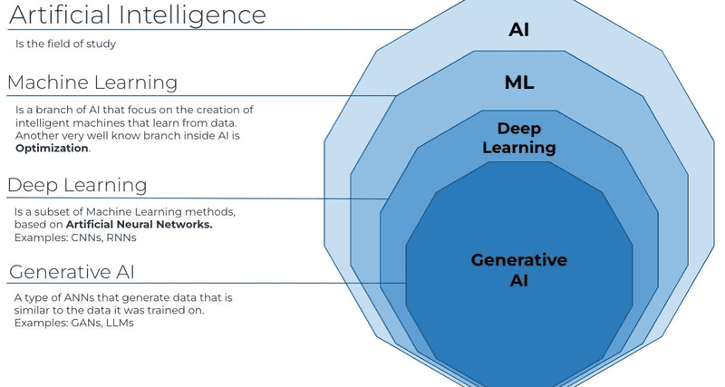
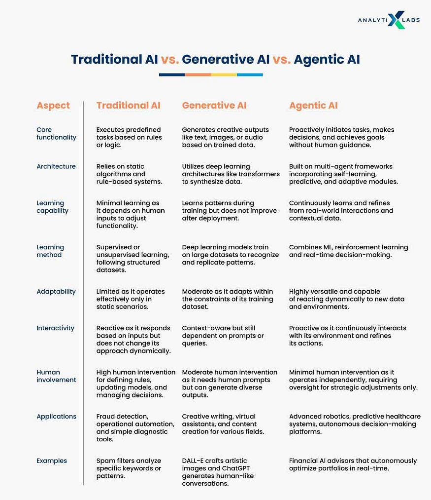

# data-science-learning-2025

- [Jupyter Notebook Setup](./jupyter_README.md)

- [Python Learning](./python/python_README.md)

- [Numpy Learning](./numpy/numpy_README.md)
- [Pandas Learning](./pandas/README.md)
- [Numpy vs Pandas](./numpy_vs_pandas_README.md)

- [AI Job Roles ](./Artificial_Intelligence/README.md)
- [AI Tools and Technologies ](./Artificial_Intelligence/Tools_Technology_README.md)
- [AI vs ML vs DL vs Gen-AI vs Agentic-AI ](./Artificial_Intelligence/AI_vs_ML_vs_DL_vs_GenAI_vs_AgenticAI_README.md)

<table>
  <tr>
    <td></td>
    <td></td>
  </tr>
</table>

# 📚 Learning Resources (YouTube + Docs)

This repository contains categorized YouTube playlists, tutorials, and useful resources for Python, Data Science, AI, ML, and FullStack development.  
All videos are shown in a **grid view** for easy navigation.

---

## 🎥 YouTube Channels
- [Krish Naik](https://www.youtube.com/@krishnaik06)
- [CampusX](https://www.youtube.com/@campusx-official)
- [Code With Harry](https://www.youtube.com/@CodeWithHarry)
- [Sagar Chouksey](https://www.youtube.com/@sagarchouksey)
- [Sheryians Coding School](https://www.youtube.com/@sheryianscodingschool)
- [Piyush Garg](https://www.youtube.com/@thepiyushgarg)
- [codebasics](https://www.youtube.com/@codebasics)

---
